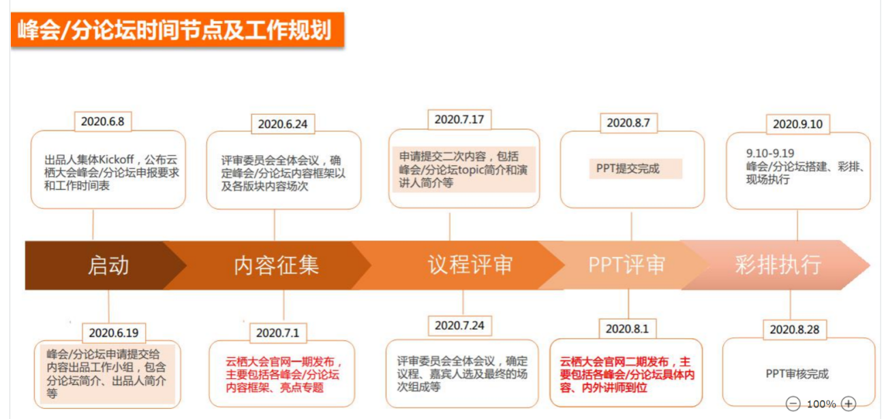

## 云栖大会2020 专场

### 2019 阿里云系统软件开发者专场
https://yunqi.youku.com/2019/hangzhou/schedule?spm=a2c4e.11165380.1395221.3#back
https://www.bilibili.com/video/av70712341/

暂时定为“阿里云系统软件生态专场”，如果我们打算推出新的品牌，到时候可以改为“斗拱”系统软件

### 生态专场
把系统软件社区及生态的架子拉起来，推出去。作为工作目标和倒推。

云栖大会上的目标和关键信息:

**目标：**

以大会为契机，把操作系统软件社区及生态的架子拉起来，推出去。
联合合作伙伴发布斗拱社区及共建倡议，集中展示阿里巴巴操作系统软件开源项目及生态，给业界造成印象这是一个由阿里巴巴发起的与华为OpenEuler社区对标的开源社区。
宣传各开源项目及技术力量，扩大社区及项目影响力，吸引更多开发者加入社区。

**关键信息:**
斗拱是一个中立，开放的操作系统开源社区和系统软件的开源创新平台。有着系统软件开源全家桶。
得到业界有影响力的合作伙伴支持，欢迎更多伙伴加入共建社区。
Alibaba Cloud Linux是一个面向云计算的稳定、高效、安全、可靠OS开源发行版，支持多处理器架构，得到众多IHV的贡献和支持。不和处理器架构做绑定。
社区将持续项目开源，发布diagnose-tools开源项目
阿里巴巴持续贡献Kata Containers开源项目，有着业界领先的技术实践，联合OpenStack社区推广Kata Containers。

Inclavare Containers致力于为业界提供一种开源的、面向机密计算和云原生的Enclave容器运行时技术栈。项目最近开源，在斗拱社区孵化和运营，阿里云已经推出ACK-TEE机密计算服务，Inclavare Containers将在阿里云上落地，Intel已经在参与，欢迎大家加入项目。

2019-09-26

### “阿里云系统软件生态专场”
本专场聚焦云时代的系统软件技术发展及生态，关注操作系统，安全容器，编译器，Java运行时等。邀请业内有影响力的大咖及开源社区伙伴，分享技术发展，探讨挑战与机遇，开源生态建设等问题。将进行开源项目重磅发布，和开源社区伙伴一起共建一个开放、合作、共赢的系统软件生态。

09:00-09:05

开场 5分钟

09:05-09:25

共建“斗拱”系统软件开放生态

马涛（伯瑜）

**共建倡议：**
1，系统软件在云时代的挑战

2，Linux发行版的分裂严重，云厂商将成为最大的 OS 发行版厂商

3，开源是系统软件发展的最佳途径

倡议：共同构建一个开放、合作、共赢的系统软件生态

发布斗拱开源社区，合作伙伴 Intel，ARM，OpenStack，Linux，Mulan，用户
接下来和客户及合作伙伴一起在讲述生态的同时，把我们的技术、产品嵌入。

09:25-9:55 30分钟

斗拱社区介绍

社区联络人 金运通

为什么建这个社区，定为是什么？

社区如何运作？

20分钟

社区联合演讲： OpenStack，Linux，Mulan... 

10分钟

09:55-10:25 30分钟

Alibaba Cloud Linux项目

智彻

阿里云智能资深技术专家

开源项目介绍10分钟，合作伙伴5+5分钟（Intel，ARM，zStack，OpenStack），用户5+5分钟 （微博，头条）

10:25-10:55 30分钟

Inclavare Container项目

阿里/Intel及其他合作伙伴

10:55-11:15 20分钟

Dragonwell 开源项目

三红 + 合作伙伴及用户 20分钟

阿里云智能资深技术专家

11:15-11:40 25分钟

Kata容器在袋鼠平台上的实践
韩伟东/刘将

阿里云智能资深技术专家

11:40-12:00 20分钟

### ali-diagnose 开源发布 
富秋/谢宝友/

工作倒推：

1  域名及商标设计、注册，内部流程

2 官网建设

3 合作伙伴（主要是OS伙伴，芯片、用户、开发者、OSV、及上层ISV）

4 ali-diagnose项目宣布开源，与Mulan社区合作，具体开源可以2-3个月之后。

5 内部沟通、构建PR渠道，大会准备工作。