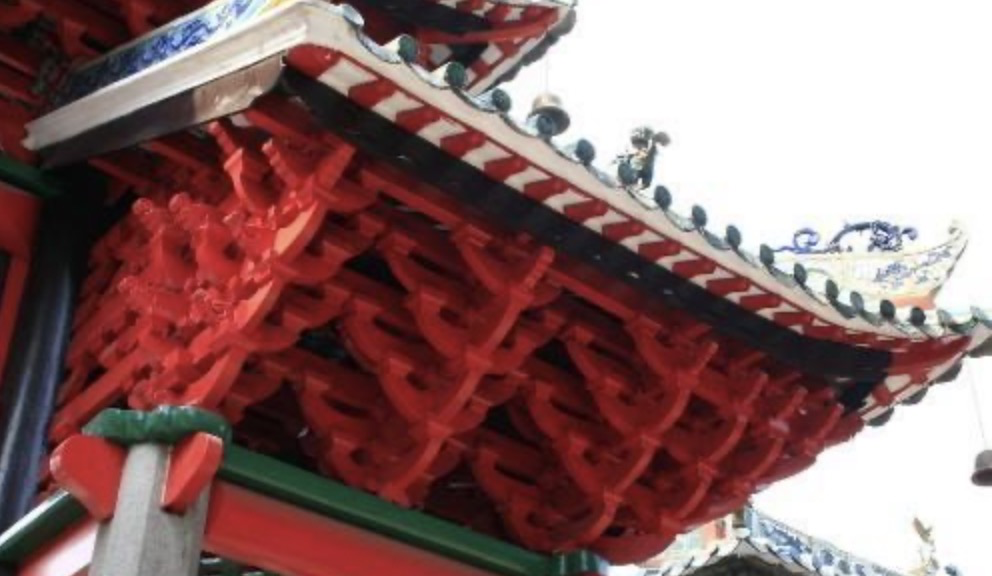
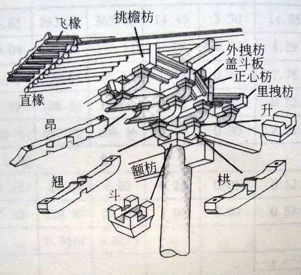

联合合作伙伴发布斗拱社区及共建倡议，集中展示阿里巴巴操作系统软件开源生态，给业界造成印象这是一个由阿里巴巴发起的与华为OpenEuler社区对标的开源社区。同时宣传各开源项目及技术力量，扩大社区及项目影响力，吸引更多开发者加入社区。

斗拱是一个中立，开放的操作系统开源社区和系统软件的开源创新平台，有着系统软件开源全家桶，得到业界有影响力的合作伙伴支持，欢迎更多伙伴加入共建社区。Alibaba Cloud Linux是一个面向云计算的稳定、高效、安全、可靠OS开源发行版，支持多处理器架构，得到众多IHV的贡献和支持。不和处理器架构做绑定。社区将持续项目开源，发布diagnose-tools开源项目。阿里巴巴持续贡献Kata Containers开源项目，有着业界领先的技术实践，联合OpenStack社区推广Kata Containers。Inclavare Containers致力于为业界提供一种开源的、面向机密计算和云原生的Enclave容器运行时技术栈。项目最近开源，在斗拱社区孵化和运营，阿里云已经推出ACK-TEE机密计算服务，Inclavare Containers将在阿里云上落地，Intel已经在参与，欢迎大家加入项目。

## 斗拱 (dougong)含义

斗拱是中国古代建筑一个构件，其通过榫卯结构紧密结合，支撑古建筑的大屋顶，形成了其独有的与西方建筑完全不同的框架体系和建筑风格。被誉为中国古代建筑中最美的建筑构件。
系统软件 -> 基础设施 -> 建筑 -> 中国特色的建筑-> 可以组装用来支撑的->  斗拱
古典建筑架构VS云架构 柱子、斗拱、屋顶VS硬件、系统软件、云
如果说硬件是柱子的话，云是屋顶，系统软件就像是斗拱，它向下依托IT硬件能力，通过一套精巧的组件构建，来向上支撑云平台及应用。
系统软件图VS斗拱组件图
斗拱社区是什么？

## 斗拱/枓栱：最美的建筑构件 
http://kaogu.cssn.cn/zwb/kgyd/kgsb/202003/t20200312_5100465.shtml

系统软件是整个ICT及云计算的基础技术栈，万层高楼平地起，需要坚实的基础，
斗拱是什么？ 
中国古代建筑的一个构件，通过榫卯结构紧密结合，古建筑的大屋顶好似飞鸟展翅一般轻盈。是什么构件在支撑着这庞大的屋顶，又是什么构件让这庞大的屋顶出檐如此深远又如此灵动呢？正是屋檐下那一个个宛如花篮模样的斗拱应运而生，起到了举足轻重的承托作用，所谓“远看擎天柱，近看百尺莲”，形容的就是这颇具中国风的古建筑构件——斗拱。

房屋面积越大，屋顶也随之越大，而木材经不起常年的风吹日晒雨淋，且刚度较小。斗拱当初就作为一种支撑大屋顶大出檐的受力构件而出现，位于屋檐下柱头与横梁之间，不仅解决了木材因刚度不够，应力对梁架结构的破坏，也加深了屋檐出挑的宽度和高度，保护了内部构件。屋面和上部构架的荷载通过斗拱传递给柱子，再由柱子传到基础，斗拱在其中起着承上启下传递荷载的作用。

## jingyu，开发者关系

区分社区、产品，开源如何帮组产品，构建影响力，聚拢用户。
社区发展生态优先级最高，不光是社区建设，还有OS开源需要去做。
OS包已经全面开源， ALinux2有大量代码清理工作，Alinux3可能实现git开源
oliver的诉求：

1. 国产化单独OS产品的交付，通过社区作为基础，构建ISV。重点但慢慢来。
2. 官网怎么支持1，先找jingyu P1，还是自己单独分开，先独立，简单，有自己的根据地，再慢慢发展。
3. 核高基，怎么参与，先看走向判断 P2，先参与会议，寻找社区建设和ISV合作的机会。

## KPI： 社区能力、影响力和生态
括内、外部的，联合PR，技术影响力，正常是6-7写，7-8总结。
KPI实现由PD+研发，然后我+运营做后面的事情。
影响力和产品运营的关系？
晓贾的KPI是ECS装机量，200%的增长，目前是贴近大客户。
夷则的诉求：

1. 开源有标杆解决方案，以dragonwell作为标杆。我去和三红团队fellow，
后续联合PR和运营（晓贾这边也有计划，需要对一下）。
2. 官网建设，通过官网，挖掘长尾用户的场景和需求，联合运营。
